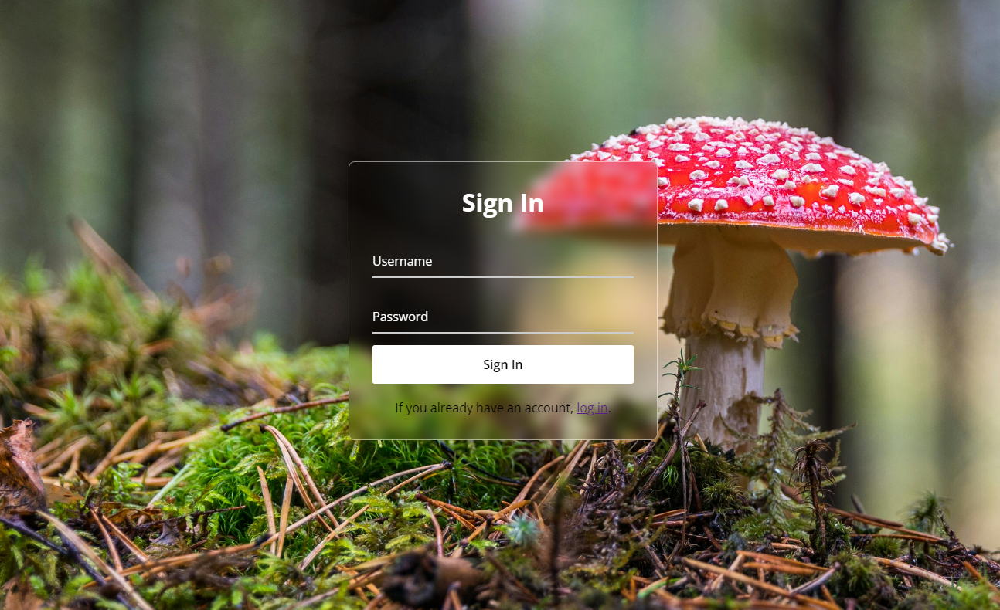

# 🍄 Mushroom Recognizer Web Application

Welcome to the Mushroom Recognizer web application! This application is designed to help you identify various species of mushrooms using a machine learning model.

## ✨ Features

### 🔐 User Authentication
- **Sign In**: New users can register by providing a username and password. The password is securely hashed before being stored in the database.
- **Log In**: Registered users can log in using their username and password. Passwords are verified using secure hashing.

### 📷 Image Upload and Prediction
- **Upload Mushroom Images**: Users can upload images of mushrooms. The application uses a machine learning model to predict the species of the mushroom in the uploaded image.
- **Supported Species**: The model can recognize the following species:
  - Agaricus
  - Amanita
  - Boletus
  - Cortinarius
  - Entoloma
  - Hygrocybe
  - Lactarius
  - Russula
  - Suillus

### 🗄️ Database Interaction
- **User Management**: User information is stored in a database. The application uses SQLAlchemy for database interactions.
- **Image Storage**: Uploaded images are stored in the `uploads` directory.

### 🌐 Routes
- **Home**: The home page provides an overview of the application and links to sign in or log in. ([`home`](app.py))
- **Sign In**: The sign-in page allows new users to register. ([`signin`](app.py))
- **Log In**: The log-in page allows registered users to log in. ([`login`](app.py))
- **Recognizer**: The recognizer page allows users to upload images for mushroom recognition. ([`recognizer`](app.py))
- **Get Analyzed Images**: Retrieves analyzed images for the logged-in user. ([`get_analyzed_images`](app.py))
- **Uploads**: Serves uploaded files. ([`uploaded_file`](app.py))
- **Check DB**: Checks the database connection. ([`check_db`](app.py))

## 🖼️ Page Images

### 🏠 Home Page


### 📝 Sign In Page


### 🔍 Recognizer Page


## 🚀 Getting Started

1. **Clone the repository**:
    ```sh
    git clone https://github.com/AndreaZanasi/MushroomRecognizer.git
    cd MushroomRecognizerFolder
    ```

2. **Set up the virtual environment**:
    ```sh
    python -m venv venv
    source venv/bin/activate
    ```

3. **Install dependencies**

4. **Set up the environment variables**:
    Create a `.env` file and add the necessary environment variables as specified in `config.py`.

5. **Run the application**:
    ```sh
    python app.py
    ```
